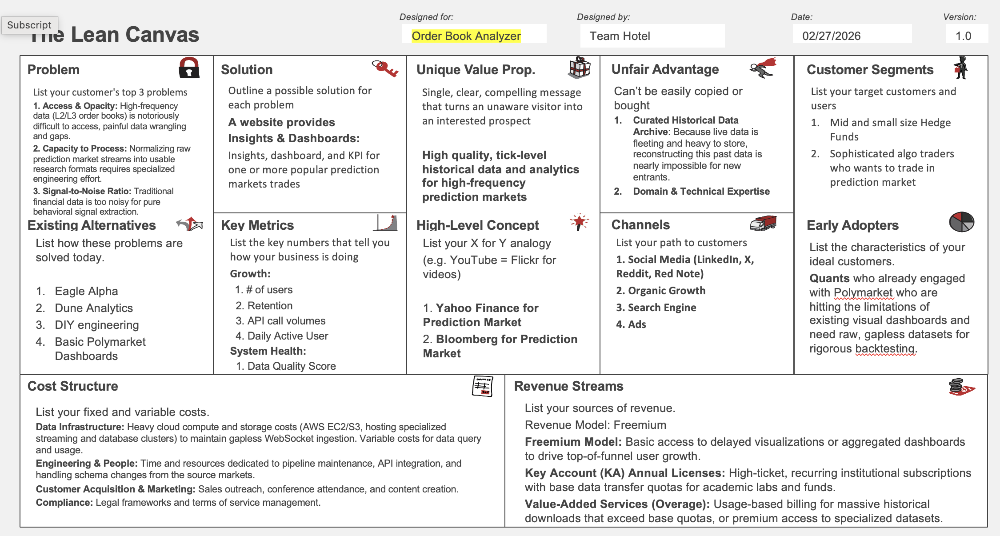
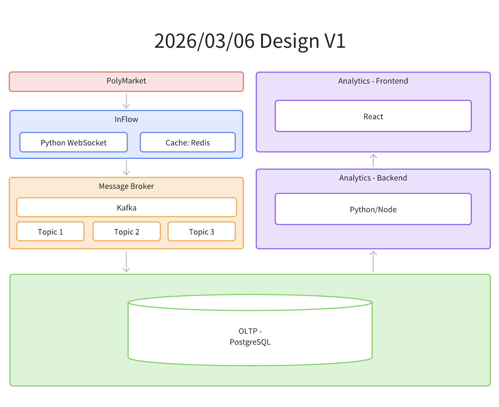

# Prediction Market Data Platform

High-frequency data platform for prediction-market analytics (Order Book Analyzer), focused on collecting, normalizing, and serving historical and live market data for quant research and trading workflows.

Deployment guides:
- Docker: `DOCKER.md`
- VM + autostart: `VM_DEPLOY.md`

## Lean Canvas Alignment

Lean canvas artifact: `docs/lean_canvas.png`



### Problem
- Access and opacity: prediction-market raw data is difficult to access and has quality gaps.
- Capacity to process: raw market streams require specialized data engineering.
- Signal-to-noise: public dashboards are not designed for robust alpha/backtesting workflows.

### Existing Alternatives
- Eagle Alpha
- Dune Analytics
- DIY engineering stacks
- Basic Polymarket dashboards

### Solution
- A website and API layer that provide insights, dashboards, and normalized datasets for one or more popular prediction markets.

### Unique Value Proposition
- High-quality, tick-level historical data and analytics for high-frequency prediction markets.

### Unfair Advantage
- Curated historical data archive.
- Domain and technical expertise in prediction-market microstructure.

### Customer Segments and Early Adopters
- Mid-size and small hedge funds.
- Sophisticated algo traders active in prediction markets.
- Early adopters: quants already using Polymarket and needing raw, gapless data for rigorous backtesting.

### Key Metrics
- Number of users.
- Retention.
- API call volumes.
- Daily active users.
- Data quality score.

### Revenue Model
- Freemium dashboard/data access tier.
- Key account annual licenses.
- Usage-based overage and premium dataset services.

## Architecture

Architecture artifact: `docs/20260306_arch_design.png`



Core components:
- Data source: Polymarket.
- Ingestion layer: Python WebSocket collector with Redis cache.
- Streaming backbone: Kafka message broker with multiple topics.
- Storage: PostgreSQL (OLTP) for persisted normalized records.
- Analytics backend: Python/Node services querying and aggregating stored data.
- Analytics frontend: React UI for dashboards and research access.

## End-to-End Data Flow

1. Market data is collected from Polymarket feeds.
2. InFlow service (Python WebSocket + Redis) ingests and buffers events.
3. Events are published to Kafka topics for decoupled processing.
4. Internal writer persists transformed batches into PostgreSQL tables.
5. Analytics backend serves curated data products to the React frontend.

## API Contracts

OpenAPI spec: `api.yaml`

External Polymarket Gamma REST endpoints documented:
- `GET /events`
- `GET /series`
- `GET /trades`

Internal persistence endpoint documented:
- `POST /internal/postgres/write`
- Allowed table targets:
  - `chainlink_prices`
  - `binance_prices`
  - `kafka_price_changes`

## External API Verification

We validated external Gamma API access using terminal `curl`:

```bash
curl -i -X GET "https://gamma-api.polymarket.com/events?closed=false&tag_id=102467&limit=500&offset=0" \
  -H "accept: application/json"
```

Success criteria:
- HTTP status `200`
- JSON response body with event records

### Why Swagger Preview can show CORS while curl works

This API is third-party. `curl` is not constrained by browser CORS policy, but Swagger Preview runs in a browser/webview origin. If that origin is not allowed by the external server's CORS headers, the browser blocks the request even when the endpoint itself is healthy.
